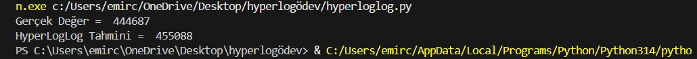

# HyperLogLog Algoritması ve Analizi

## Proje Açıklaması
Bu projede HyperLogLog algoritması tanıtılmıştır. 
Zaman-bellek karmaşıklığı, avantaj ve dezavantajları vb. konularla analizi yapılmıştır.  
Python ile implementasyonu yapılmıştır.  
HyperLogLog, büyük veri sistemlerinde farklı eleman sayısını yaklaşık olarak hesaplamak için kullanılan olasılıksal bir algoritmadır.  
Algoritma, milyonlarca veri içinden **unique (benzersiz) eleman sayısını** tahmin ederken çok düşük bellek kullanır.

## Problem Tanımı
Büyük veri sistemlerinde veri setleri milyonlarca hatta milyarlarca elemandan oluşabilir.  
Farklı eleman sayısını tam olarak hesaplamak, her bir elemanı saklamayı gerektirir ve **çok fazla bellek kullanır**.  

HyperLogLog algoritması, bu problemi **çok az bellekle ve yüksek hızda yaklaşık olarak** çözer.

**Algoritmanın nasıl çalıştığı sunum videosunda anlatılmıştır.**

## Kullanılan Teknolojiler
- Python 3  
- hashlib : Projede gelen verinin hashlenmesi(şifrelenmesi) için kullanılmıştır. 
- random : Projede veri kümesini rastgele sayılarla doldurmak için kullanılmıştır.  

## Kurulum ve Çalıştırma
1. Projeyi klonlayın:
```bash
git clone https://github.com/emirccnz/HyperLogLog-Algoritmasi-ve-Analizi.git
```
2. Python dosyasını çalıştırın:
```bash
python hyperloglog.py
```
## Örnek Çıktılar:
### 1.
Bucket Sayısı = 10 iken:


### 2.
Bucket Sayısı = 12 iken:


Örnek çıktılarda da belirtildiği üzere bucket sayısı genellikle tahmin hassasiyetini arttırır ve algoritma gerçeğe yakın sonuç verir.


Proje Sunum Vidosuna Aşağıdaki Linten Ulaşabilirsiniz.

https://youtu.be/yRxswxNYywE


## Kaynaklar:
https://en.wikipedia.org/wiki/HyperLogLog 

https://ardabatuhandemir.medium.com/redis-hyperloglog-hll-python-ile-nltk-dijital-k%C3%BCt%C3%BCphanesinin-analizi-hyperloglog-algoritmas%C4%B1-99a47daea0ca 

https://chatgpt.com/
